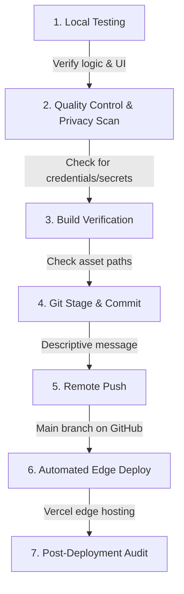

# Operational Pipeline Guide: Test, Build, Push, Deploy

This guide details the standardized lifecycle for modifying, validating, committing, pushing, and deploying updates to the **Vibe Coding Optimization Hub** securely and efficiently.

---

## 📋 1. Standard Pipeline Flowchart



---

## 🧪 2. Local Testing Protocol

Before committing any modifications, execute these validation checks locally to ensure complete stability:

### A. Mathematical Logic Verification
- **Calculator Sliders**: Slide the files and prompts values to minimum and maximum ranges.
- **Billing Estimates**: Select different LLM models and confirm the token costs match the pricing rate cards.
- **Circuit Breakers**: Execute mock auditor scans and confirm that recursive infinite agent loops are successfully intercepted by the compute firewall.

### B. Compactions & Exporters
- **Prompt Compactor**: Input code snippets containing comments (`//`, `/* */`, `#`). Confirm comments are cleanly stripped and white spaces collapsed.
- **Cursorrules Export**: Toggle all parameters, verify the checkbox outputs update, and test the copy-to-clipboard actions.

### C. Visual & Aspect Ratio Responsiveness
- **Multi-Modal Vision Grid**: Change sizes (width, height) and detail modes. Confirm the physical canvas grid highlights visual segment boundaries cleanly.

---

## 🏗 3. Quality Control & Privacy Verification

Since this is a static frontend deployment, the "build" stage involves direct visual asset verification:

1. **Path Audits**: Ensure all local stylesheet references, script elements, and assets use relative paths.
2. **Secrets & Identifier Scans**: Ensure **no** personal folders (e.g. user directory paths like `c:\Users\z00545fp\...`) or API credentials exist in `app.js` or `index.html`.
3. **Linter Baseline**: Open your browser's Developer Tools Console (`F12`) to verify there are no syntax exceptions or unresolved network asset queries.

---

## 🚀 4. Git Version Control and Exclusion Audit

Our repository is configured with robust `.gitignore` rules. Ensure you follow standard Git practices:

```bash
# 1. Inspect active file status
git status

# 2. Stage verified modifications
git add <filename>   # Or 'git add .' to stage all tracked, modified files

# 3. Commit with descriptive semantic structures
git commit -m "feat: enhance compactor regex parsing and optimize vision grids"

# 4. Push branch securely to GitHub
git push origin main
```

> [!WARNING]
> Always verify that your status does not include any untracked `.env` configurations or system log files before pushing to the public repository.

---

## ☁️ 5. Production Deployment Pipeline

Our main pipeline is fully integrated with **Vercel** CI/CD:

- **Trigger**: Every push event on the `main` branch automatically triggers Vercel.
- **Framework Preset**: Configured to `Other` to serve the static root (`index.html`) directly.
- **Hosting Networks**: Distributed immediately on Vercel's Global Edge Network with zero downtime.

### Active Interfaces:
- **Core App URL**: [vibe.mytokencost.com](https://vibe.mytokencost.com)
- **Deployment URL**: [mytokencost-vibe.vercel.app](https://mytokencost-vibe.vercel.app)
